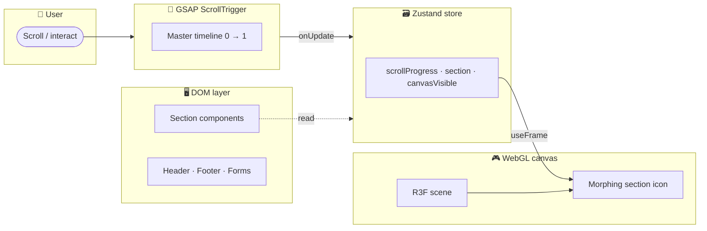
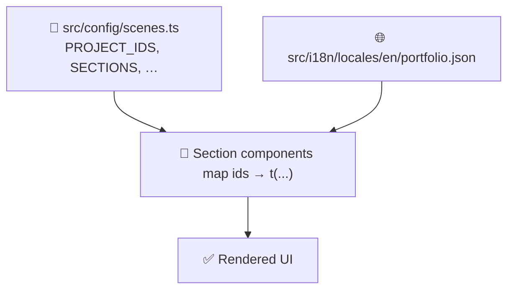

<div align="center">

# 🚀 Portfolio

**✨ An immersive 3D portfolio built with React 19, Three.js, and scroll-driven motion ✨**

🎬 A persistent WebGL scene choreographs section icons while DOM overlays present content — 🌍 internationalised, 🌗 theme-aware, ♿ accessible, and 📱 installable as a PWA.

[](https://react.dev)
[](https://www.typescriptlang.org)
[](https://vite.dev)
[](https://threejs.org)
[](https://tailwindcss.com)

</div>

---

## 📑 Table of contents

- [🔭 Overview](#-overview)
- [✨ Features](#-features)
- [🧰 Tech stack](#-tech-stack)
- [🏗️ Architecture](#️-architecture)
- [📁 Project structure](#-project-structure)
- [⚡ Getting started](#-getting-started)
- [🔐 Environment variables](#-environment-variables)
- [🚢 Deploy to GitHub Pages](#-deploy-to-github-pages)
- [📝 Content guide](#-content-guide)
- [✅ Quality gates](#-quality-gates)

---

## 🔭 Overview

This repository is a single-page portfolio that combines a fixed WebGL canvas with scroll-synced DOM sections. 🎯 GSAP ScrollTrigger drives a master timeline; 🗃️ Zustand holds scroll progress and the active section index; ⚛️ React renders content, navigation, and forms on top.

The site targets production quality: 🔒 strict TypeScript, 🧹 ESLint with accessibility rules, 💅 Prettier formatting on commit, 📦 code-split WebGL, 🔤 self-hosted fonts, and 📲 a Workbox-powered PWA.

---

## ✨ Features

|                             |                                                                                                                                                         |
| --------------------------- | ------------------------------------------------------------------------------------------------------------------------------------------------------- |
| 🎨 **Scroll choreography**  | One morphing 3D icon lerps between section poses via a single ScrollTrigger timeline — no per-section remounts.                                         |
| 🌗 **Theme system**         | Light and dark palettes via Tailwind v4 design tokens, cookie-backed preference, and a circular full-page reveal when toggling from the header.         |
| 🌍 **Internationalisation** | `i18next` with typed namespaces; copy lives in JSON under `src/i18n/locales/`.                                                                          |
| ♿ **Accessibility**        | Skip link, live region for section changes, semantic landmarks, focus styles, and `prefers-reduced-motion` respected (including instant theme changes). |
| 📱 **PWA**                  | `vite-plugin-pwa` precaches static assets and locale bundles for offline-friendly loading.                                                              |
| 🧱 **Data-driven UI**       | Projects, skills, timeline entries, testimonials, and social links render from config arrays — add an id and translations, not JSX.                     |
| ✉️ **Contact form**         | React 19 Actions + Web3Forms; validates client-side and degrades gracefully when no API key is configured.                                              |
| 🚀 **CI deploy**            | Push to `main` builds and publishes to GitHub Pages via GitHub Actions.                                                                                 |

---

## 🧰 Tech stack

| Layer              | Libraries                                                                                       |
| ------------------ | ----------------------------------------------------------------------------------------------- |
| ⚛️ **Core**        | React 19, TypeScript 5.7, Vite 8                                                                |
| 🎮 **3D / motion** | `@react-three/fiber`, `@react-three/drei`, Three.js, GSAP + ScrollTrigger, Framer Motion, Lenis |
| 🎨 **UI / state**  | Tailwind CSS v4, Zustand, `i18next`, Lucide React, Simple Icons                                 |
| 🛠️ **Tooling**     | ESLint, Prettier, Husky, lint-staged, `vite-plugin-pwa`                                         |

---

## 🏗️ Architecture

### 🧩 Layer model



### 🔗 Scroll ↔ 3D boundary

React components subscribe to Zustand for section index and UI state. The canvas reads `scrollProgress` inside `useFrame`, lerping between poses at 60 fps without triggering React re-renders. ⚡

### 📋 Config-driven content



Identifiers and layout live in `src/config/enums.ts` and domain config files. Components import enums and data directly from `src/config/*` — no barrel re-exports. 🎯

---

## 📁 Project structure

```text
portfolio/
├── .github/workflows/
│   └── 🚀 deploy.yml          # GitHub Pages CI
├── .husky/
│   ├── pre-commit             # lint-staged (ESLint + Prettier)
│   └── pre-push               # type-check
├── public/                    # Static assets (favicon, PWA icons, og-image)
├── src/
│   ├── assets/                # GLB models, section model registry
│   ├── components/
│   │   ├── canvas/            # R3F scene, camera rig, layers
│   │   └── ui/                # Sections, layout primitives, icons
│   ├── config/
│   │   ├── enums.ts           # Shared string enums (SectionId, Theme, …)
│   │   ├── scenes.ts          # Sections, poses, project ids & links
│   │   ├── site.ts            # Brand, SEO, CSP, PWA manifest helpers
│   │   ├── socialLinks.ts     # Social URLs
│   │   ├── skills.ts          # Skill id list
│   │   ├── env.ts             # Runtime Vite env access
│   │   └── …
│   ├── hooks/
│   ├── i18n/locales/en/       # common · meta · portfolio
│   ├── lib/                   # URL helpers, morph math, PWA registration
│   ├── store/                 # Zustand
│   └── theme/                 # ThemeProvider, tokens, scene palette
├── vite.config.ts
└── package.json
```

---

## ⚡ Getting started

> **📌 Requires** Node.js 20+ and npm.

```bash
# 🔑 1. Create your env file (do this before the first dev run)
cp .env.example .env
# Windows (Command Prompt): copy .env.example .env
# Windows (PowerShell):     Copy-Item .env.example .env

# Open .env and set your values (see Environment variables below).
# VITE_WEB3FORMS_KEY — required if you want the contact form to send mail locally.

# 📦 2. Install dependencies
npm install

# 🏃 3. Start the dev server (http://localhost:5173)
npm run dev

# 🔨 Production build
npm run build

# 👀 Preview the production build locally
npm run preview
```

### 📜 Scripts

| Script               | What it does                                        |
| -------------------- | --------------------------------------------------- |
| `npm run dev`        | 🏃 Vite dev server with HMR                         |
| `npm run build`      | 🔨 Type-check (`tsc -b`) then Vite production build |
| `npm run preview`    | 👀 Serve `dist/` locally                            |
| `npm run lint`       | 🧹 ESLint across the repo                           |
| `npm run format`     | 💅 Prettier write                                   |
| `npm run type:check` | 🔍 TypeScript project references check              |

---

## 🔐 Environment variables

Copy [`.env.example`](.env.example) to **`.env`** before your first run (see [Getting started](#-getting-started)). Vite loads `.env` in all modes (`dev`, `build`, `preview`).

```bash
cp .env.example .env   # then edit .env
```

| Variable               | Required                    | Purpose                                                     |
| ---------------------- | --------------------------- | ----------------------------------------------------------- |
| `VITE_GITHUB_USERNAME` | Optional locally; set in CI | 🖼️ GitHub username for project card preview images          |
| `VITE_WEB3FORMS_KEY`   | Optional locally; set in CI | ✉️ Public Web3Forms access key for the contact form         |
| `VITE_RESUME_URL`      | Optional                    | 📄 When set, shows a resume download button in the hero     |
| `VITE_BASE`            | CI / local prod preview     | 🌐 GitHub Pages project-site base path (e.g. `/portfolio/`) |

> **Note:** `.env` is in [`.gitignore`](.gitignore) so it is never committed. Only `.env.example` stays in the repo as documentation.

Runtime code reads env through [`src/config/env.ts`](src/config/env.ts). Asset paths use `import.meta.env.BASE_URL` at runtime.

---

## 🚢 Deploy to GitHub Pages

### 🛠️ One-time setup

1. ⬆️ Push the repository to GitHub.
2. ⚙️ Open **Settings → Pages**.
3. 🎯 Under **Build and deployment → Source**, choose **GitHub Actions**.

Every push to `main` runs [`.github/workflows/deploy.yml`](.github/workflows/deploy.yml):

1. 📦 `npm ci`
2. 🔨 `npm run build` with `VITE_BASE=/<repo>/`
3. 📝 Writes `dist/.nojekyll`
4. 🚀 Publishes via `actions/deploy-pages`

Configure repository secrets:

- `VITE_GITHUB_USERNAME` — 🖼️ set automatically from the repo owner in CI
- `VITE_WEB3FORMS_KEY` — ✉️ contact form
- `VITE_RESUME_URL` — 📄 optional resume PDF URL

### 🌍 Custom domain

Add a `CNAME` in `public/` and remove the `VITE_BASE` line from the workflow — custom domains serve from `/`, not `/<repo>/`.

### 🧪 Local Pages preview

```bash
VITE_BASE=/portfolio/ npm run build
npm run preview -- --base /portfolio/
```

---

## 📝 Content guide

> 💡 **The pattern:** add an id to the relevant config array → add matching keys in `src/i18n/locales/en/*.json` → register an icon if needed → done. Section components map over the array automatically.

### 💼 Add a project

1. ➕ Add a member to `ProjectId` in [`src/config/enums.ts`](src/config/enums.ts).
2. 📂 Append it to `PROJECT_IDS` and optional `PROJECT_LINKS` in [`src/config/scenes.ts`](src/config/scenes.ts).
3. 🌐 Add `portfolio.items.<id>.{name,description,stack}` in [`src/i18n/locales/en/portfolio.json`](src/i18n/locales/en/portfolio.json).

### 🛠️ Add a skill

1. ➕ Add to `SkillId` in `enums.ts` and `SKILL_IDS` in [`src/config/skills.ts`](src/config/skills.ts).
2. 🎨 Register the slug in [`src/components/ui/icons/BrandIcon.tsx`](src/components/ui/icons/BrandIcon.tsx) if it is not already present.
3. 🌐 Add `skills.items.<id>` in `portfolio.json`.

### 🔗 Add a social link

1. ➕ Add to `SocialId` in `enums.ts`.
2. 📂 Append `{ id, href }` in [`src/config/socialLinks.ts`](src/config/socialLinks.ts).
3. 🎨 Register the icon in [`src/components/ui/icons/SocialIcon.tsx`](src/components/ui/icons/SocialIcon.tsx).
4. 🌐 Add `social.<id>` in [`src/i18n/locales/en/common.json`](src/i18n/locales/en/common.json).

### 📑 Add a section

1. ➕ Add to `SectionId` in `enums.ts` and append to `SECTIONS` + poses in `scenes.ts`.
2. 🧩 Create `src/components/ui/sections/<Name>Section.tsx` using `ContentSection`.
3. 🔌 Mount it in [`src/components/ui/ScrollSections.tsx`](src/components/ui/ScrollSections.tsx).
4. 🌐 Add navigation and copy keys in the locale files.

### 🎨 Edit branding

Update `SITE` in [`src/config/site.ts`](src/config/site.ts) — name, description, theme colours, and SEO defaults flow from there.

---

## ✅ Quality gates

| Gate             | Tool                         | When                                     |
| ---------------- | ---------------------------- | ---------------------------------------- |
| 🧹 Lint          | ESLint (+ jsx-a11y, i18next) | pre-commit, manual                       |
| 💅 Format        | Prettier                     | pre-commit (lint-staged re-stages fixes) |
| 🔍 Types         | `tsc -b`                     | build, pre-push                          |
| ♿ Accessibility | eslint-plugin-jsx-a11y       | pre-commit                               |

> 🐺 Husky runs `lint-staged` before every commit so only formatted, lint-fixed files are committed. Pre-push runs `npm run type:check`.

<div align="center">

⭐ **If you like this project, give it a star!** ⭐

</div>
